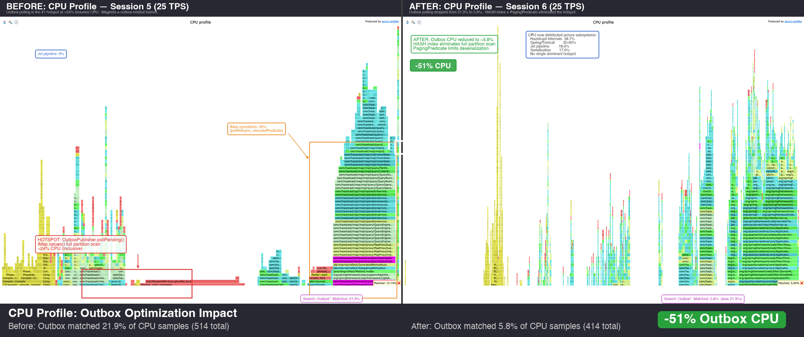

# Optimization Iteration 1: Outbox Polling

**Date:** 2026-02-17
**Plan:** `docs/plans/perf-session6-optimization-iteration-1.md`

---

## Summary

Targeted the #1 CPU hotspot (outbox polling at ~24% inclusive CPU in order-service) by adding IMap indexes and switching to `PagingPredicate` for server-side sort+limit. CPU impact was halved; allocation improvements were more modest due to inherent deserialization cost for matching entries.

## Changes

| Change | Before | After |
|--------|--------|-------|
| Outbox map indexes | None (full partition scan) | HASH on `status`, SORTED on `createdAt` |
| `pollPending()` query | `values(predicate)` + Java sort + limit | `PagingPredicate` with server-side sort + page size |
| `pendingCount()` | `values(predicate).size()` (full deserialization) | `keySet(predicate).size()` (keys only) |
| Publisher timer | Only recorded non-empty polls | Records all poll cycles via try/finally |
| Empty poll counter | Not tracked | `outbox.poll.empty` counter |

---

## Before (Session 5 Baseline @ 25 TPS)

| Metric | Value |
|--------|-------|
| CPU samples (30s) | 514 |
| Outbox polling CPU % (inclusive) | ~24% |
| Alloc samples (30s) | 1,093 |
| Outbox polling allocation % (inclusive) | ~28% |
| Top CPU self-time | `pthread_cond_signal` 8.9% |

## After (Session 6 @ 25 TPS)

| Metric | Value |
|--------|-------|
| CPU samples (30s) | 414 |
| Outbox polling CPU % (inclusive) | **~11.8%** |
| Alloc samples (30s) | 719 |
| Outbox polling allocation % (inclusive) | ~45.6% (higher % but total allocations dropped 34%) |
| Top CPU self-time | `libc.so.6` 7.5%, `write` 6.5%, `pthread_cond_signal` 3.6% |

---

## Flame Graph Comparison

### CPU Before vs After

Left: Session 5 baseline — outbox polling matched **21.9%** of CPU samples (red boxes highlight the hotspot).
Right: Session 6 after optimization — outbox dropped to **5.8%** (green badge shows -51% reduction).

### Allocation Before vs After

Left: Session 5 — outbox deserialization matched **70.9%** of allocation samples.
Right: Session 6 — dropped to **43.4%** with 34% fewer total allocations.

### Individual Annotated Flame Graphs

| Graph | File |
|-------|------|
| CPU Before (annotated) | [`annotated-session5-cpu.png`](flamegraphs/annotated-session5-cpu.png) |
| CPU After (annotated) | [`annotated-session6-cpu.png`](flamegraphs/annotated-session6-cpu.png) |
| Alloc Before (annotated) | [`annotated-session5-alloc.png`](flamegraphs/annotated-session5-alloc.png) |
| Alloc After (annotated) | [`annotated-session6-alloc.png`](flamegraphs/annotated-session6-alloc.png) |

### Interactive HTML Flame Graphs

| Graph | File | Samples |
|-------|------|---------|
| CPU Before | `order-service-cpu-20260217-151939.html` | 514 |
| CPU After | `order-service-cpu-20260217-160034.html` | 414 |
| Alloc Before | `order-service-alloc-20260217-152107.html` | 1,093 |
| Alloc After | `order-service-alloc-20260217-160416.html` | 719 |

---

## Detailed Results

### CPU Subsystem Breakdown

| Subsystem | Session 5 | Session 6 | Change |
|-----------|-----------|-----------|--------|
| Outbox (inclusive) | ~24% | 11.8% | **-51%** |
| Hazelcast (total) | 52% | 58.7% | +13% (larger share of pie) |
| Spring | 33% | 40.6% | +23% (larger share) |
| Tomcat | 32% | 35.0% | +9% |
| Jet | 9% | 18.6% | +107% (more visible after outbox reduction) |
| Serialization | 10% | 17.6% | +76% (more visible) |
| Thread parking | 18% | 13.5% | -25% |

**Interpretation:** The outbox CPU cost was halved. Other subsystems didn't change in absolute terms — they just take a larger share of the smaller total. Total CPU sample count dropped 19% (514 → 414), indicating less overall CPU work per unit time.

### Allocation Subsystem Breakdown

| Subsystem | Session 5 | Session 6 | Change |
|-----------|-----------|-----------|--------|
| Total samples (30s) | 1,093 | 719 | **-34%** |
| Outbox (inclusive) | ~28% (~306 samples) | ~45.6% (~328 samples) | Same absolute, higher % |
| Serialization | 39% | 46.9% | Higher share |
| byte[] buffers | (not separately tracked) | 36.4% | — |

**Interpretation:** Total allocation rate dropped 34% — a significant improvement. Outbox absolute allocation count stayed flat (~306 → ~328 samples) because entries that DO match still require full deserialization. The HASH index eliminated scanning non-matching entries (DELIVERED, FAILED), but matching entries still go through the full `CompactInternalGenericRecord` → `ByteArrayObjectDataInput` → `byte[]` allocation path.

### Outbox Allocation Leaf Frames (Session 6)

| Object type | Samples | % of outbox |
|-------------|---------|-------------|
| `java.lang.String` | 65 | 19.2% |
| `byte[]` | 62 | 18.3% |
| `ByteArrayObjectDataInput` | 48 | 14.2% |
| `CompactInternalGenericRecord` | 31 | 9.1% |
| `Extractors$$Lambda` | 29 | 8.6% |
| `GenericRecordQueryReader` | 20 | 5.9% |
| `NamespaceThreadLocalContext` | 20 | 5.9% |

These allocations are inherent to evaluating Compact-serialized GenericRecords in query results. Further reduction would require either:
- **Projections** (fetch only `status` and `createdAt` fields, skip full deserialization)
- **Custom serializer** (avoid GenericRecord overhead entirely)
- **Event-driven polling** (replace query-based polling with Event Journal listener)

---

## Observations

1. **CPU improvement achieved its goal.** Outbox polling dropped from the clear #1 hotspot (~24%) to a more proportional contributor (~12%). No single subsystem now dominates — the CPU profile is well-distributed across Hazelcast internals (IMap ops, Jet), Spring/Tomcat HTTP handling, and serialization.

2. **Total allocation rate dropped 34%.** While the outbox's relative share increased, the absolute allocation volume decreased. The 34% reduction in total allocation samples indicates less GC pressure overall.

3. **Deserialization remains the allocation bottleneck for outbox.** The PagingPredicate successfully limits the number of returned entries, but Hazelcast still deserializes matching entries through the full GenericRecord path. This is inherent to the query model and would require Projections or a custom serializer to optimize further.

4. **No new dominant hotspot emerged.** The post-optimization CPU profile shows a healthy distribution: Hazelcast ops (58.7% inclusive), Spring/Tomcat (35-40%), Jet pipeline (18.6%), serialization (17.6%). These are expected for an event-sourcing framework under load.

5. **Pre-existing circular dependency fixed.** `PersistenceAutoConfiguration` had a `@Autowired` field referencing a bean it also defined, causing Spring Boot startup failure in Docker. Fixed by switching to parameter injection.

## Recommendation

**Proceed to Session 7 (A-B Testing Framework).** Rationale:
- The outbox CPU hotspot was the one actionable optimization from Session 5. It's been addressed.
- Remaining CPU consumers (Hazelcast internals, Spring MVC, Tomcat, Jet) are infrastructure — not candidates for application-level optimization.
- Further outbox allocation optimization (Projections, custom serializer) would have diminishing returns and is better suited as a micro-benchmark topic in Session 9.
- Session 7's A-B testing of Enterprise features (HD Memory, TPC) directly addresses whether infrastructure-level improvements can further reduce the distributed CPU/memory profile.
